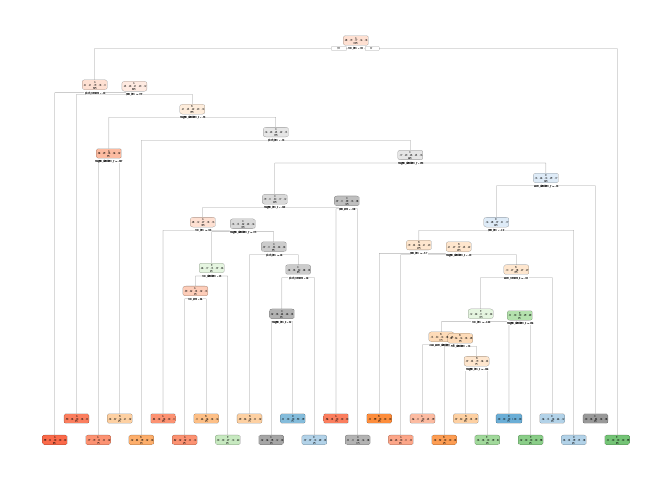
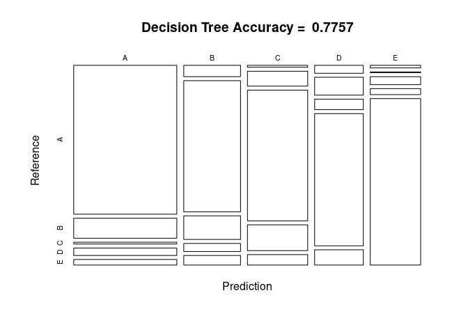
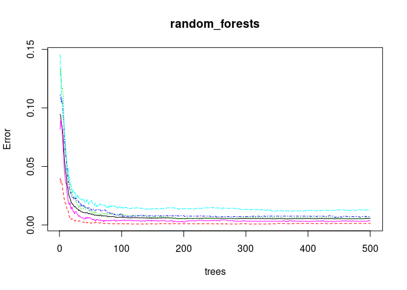
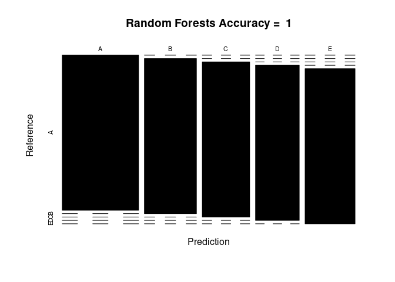

## 0. Project Goal

The goal of your project is to predict the manner in which they did the exercise. This is the "classe" variable in the training set. You may use any of the other variables to predict with. You should create a report describing how you built your model, how you used cross validation, what you think the expected out of sample error is, and why you made the choices you did. You will also use your prediction model to predict 20 different test cases.

## 1. Load Libraries


```r
library(randomForest)
library(rattle)
library(rpart.plot)
library(rpart)
library(ggplot2)
library(lattice)
library(caret)
library(gbm)
```

## 2. Load and Clean Data


```r
set.seed(14082020) # reproducibility

data_training <- read.csv(file="dataset/pml-training.csv", na.strings=c("NA", "#DIV/0!", ""), header=TRUE)

data_testing <- read.csv(file="dataset/pml-testing.csv", na.strings=c("NA", "#DIV/0!", ""), header=TRUE)

# Remove missing values

data_training <- data_training[, colSums(is.na(data_training)) == 0]

data_testing <- data_testing[, colSums(is.na(data_testing)) == 0]
```

## 3. Resample Datasets


```r
# Training data resampling: remove unnecessary columns (1:7)

data_training <- data_training[, -c(1:7)]

# Testing data resampling: remove unnecessary columns (1:7), and the "problem_id" column (of the Coursera assignment project)

data_testing <- data_testing[, -c(1:7)]
data_testing <- data_testing[, -c(length(data_testing))]
```

### 3.1. Create a validation sample


```r
set.seed(14082020) # reproducibility

# 70% training; 30% validation

training <- createDataPartition(data_training$classe, p=0.7, list=FALSE)
data_training <- data_training[training, ]
data_validation <- data_training[-training, ]

dim(data_training)
```

```
## [1] 13737    53
```

```r
dim(data_validation)
```

```
## [1] 4111   53
```

```r
dim(data_testing)
```

```
## [1] 20 52
```

### 3.2. Analyse Correlated Features


```r
corr <- cor(data_training[, -length(data_training)])

# Highly correlated features, cutoff = 0.8

corr_high <- findCorrelation(corr, cutoff=0.8)
names(data_training)[corr_high]
```

```
##  [1] "accel_belt_z"     "roll_belt"        "accel_belt_y"     "accel_dumbbell_z"
##  [5] "accel_belt_x"     "pitch_belt"       "accel_arm_x"      "accel_dumbbell_x"
##  [9] "magnet_arm_y"     "gyros_forearm_y"  "gyros_dumbbell_x" "gyros_dumbbell_z"
## [13] "gyros_arm_x"
```

## 4. Build Model 1: Decision Tree


```r
set.seed(14082020) # reproducibility
decision_tree <- rpart(classe ~., data=data_training, method="class")

# Plot the tree
rpart.plot(decision_tree)
```

```
## Warning: labs do not fit even at cex 0.15, there may be some overplotting
```

<!-- -->

## 5. Model 1 Results


```r
decision_tree_pred <- predict(decision_tree, data_validation, type="class")

confusion_matrix <- confusionMatrix(decision_tree_pred, data_validation$classe)
confusion_matrix
```

```
## Confusion Matrix and Statistics
## 
##           Reference
## Prediction    A    B    C    D    E
##          A 1076  145   13   54   40
##          B   45  522   94   32   38
##          C    8   63  552  109   44
##          D   27   61   36  451   52
##          E    9    3   28   21  588
## 
## Overall Statistics
##                                           
##                Accuracy : 0.7757          
##                  95% CI : (0.7627, 0.7884)
##     No Information Rate : 0.2834          
##     P-Value [Acc > NIR] : < 2.2e-16       
##                                           
##                   Kappa : 0.715           
##                                           
##  Mcnemar's Test P-Value : < 2.2e-16       
## 
## Statistics by Class:
## 
##                      Class: A Class: B Class: C Class: D Class: E
## Sensitivity            0.9236   0.6574   0.7635   0.6762   0.7717
## Specificity            0.9145   0.9370   0.9339   0.9489   0.9818
## Pos Pred Value         0.8102   0.7141   0.7113   0.7193   0.9060
## Neg Pred Value         0.9680   0.9195   0.9487   0.9380   0.9497
## Prevalence             0.2834   0.1931   0.1759   0.1622   0.1854
## Detection Rate         0.2617   0.1270   0.1343   0.1097   0.1430
## Detection Prevalence   0.3230   0.1778   0.1888   0.1525   0.1579
## Balanced Accuracy      0.9190   0.7972   0.8487   0.8125   0.8767
```

```r
plot(confusion_matrix$table, col=confusion_matrix$byClass,
     main=paste("Decision Tree Accuracy = ",
                round(confusion_matrix$overall['Accuracy'], 4)))
```

<!-- -->

## 5. Build Model 2: Random Forests


```r
set.seed(14082020) # reproducibility
random_forests <- randomForest(classe ~., data=data_training)

# Plot the random forests
plot(random_forests)
```

<!-- -->

## 6. Model 2 Results


```r
random_forests_pred <- predict(random_forests, data_validation, type="class")

cm_rf <- confusionMatrix(random_forests_pred, data_validation$classe)
cm_rf
```

```
## Confusion Matrix and Statistics
## 
##           Reference
## Prediction    A    B    C    D    E
##          A 1165    0    0    0    0
##          B    0  794    0    0    0
##          C    0    0  723    0    0
##          D    0    0    0  667    0
##          E    0    0    0    0  762
## 
## Overall Statistics
##                                      
##                Accuracy : 1          
##                  95% CI : (0.9991, 1)
##     No Information Rate : 0.2834     
##     P-Value [Acc > NIR] : < 2.2e-16  
##                                      
##                   Kappa : 1          
##                                      
##  Mcnemar's Test P-Value : NA         
## 
## Statistics by Class:
## 
##                      Class: A Class: B Class: C Class: D Class: E
## Sensitivity            1.0000   1.0000   1.0000   1.0000   1.0000
## Specificity            1.0000   1.0000   1.0000   1.0000   1.0000
## Pos Pred Value         1.0000   1.0000   1.0000   1.0000   1.0000
## Neg Pred Value         1.0000   1.0000   1.0000   1.0000   1.0000
## Prevalence             0.2834   0.1931   0.1759   0.1622   0.1854
## Detection Rate         0.2834   0.1931   0.1759   0.1622   0.1854
## Detection Prevalence   0.2834   0.1931   0.1759   0.1622   0.1854
## Balanced Accuracy      1.0000   1.0000   1.0000   1.0000   1.0000
```

```r
plot(cm_rf$table, col=cm_rf$byClass, 
     main=paste("Random Forests Accuracy = ",
                round(cm_rf$overall['Accuracy'], 4)))
```

<!-- -->

## 7. Build Model 3: Generalized Boosted Regression


```r
set.seed(14082020) # reproducibility
library(caret)
control_boost <- trainControl(method="repeatedcv",
                              number=5,
                              repeats=1)
gbr <- train(classe ~., data=data_training, method="gbm",
             trControl=control_boost, verbose=FALSE)
gbr$finalModel
```

```
## A gradient boosted model with multinomial loss function.
## 150 iterations were performed.
## There were 52 predictors of which 52 had non-zero influence.
```

## 8. Model 3 Results


```r
gbm_pred <- predict(gbr, newdata=data_validation)

cm_gbm <- confusionMatrix(gbm_pred, data_validation$classe)
cm_gbm
```

```
## Confusion Matrix and Statistics
## 
##           Reference
## Prediction    A    B    C    D    E
##          A 1153   14    0    1    0
##          B    7  765   16    2    4
##          C    4   15  694   22    4
##          D    0    0   12  637    6
##          E    1    0    1    5  748
## 
## Overall Statistics
##                                           
##                Accuracy : 0.9723          
##                  95% CI : (0.9668, 0.9771)
##     No Information Rate : 0.2834          
##     P-Value [Acc > NIR] : < 2e-16         
##                                           
##                   Kappa : 0.9649          
##                                           
##  Mcnemar's Test P-Value : 0.03782         
## 
## Statistics by Class:
## 
##                      Class: A Class: B Class: C Class: D Class: E
## Sensitivity            0.9897   0.9635   0.9599   0.9550   0.9816
## Specificity            0.9949   0.9913   0.9867   0.9948   0.9979
## Pos Pred Value         0.9872   0.9635   0.9391   0.9725   0.9907
## Neg Pred Value         0.9959   0.9913   0.9914   0.9913   0.9958
## Prevalence             0.2834   0.1931   0.1759   0.1622   0.1854
## Detection Rate         0.2805   0.1861   0.1688   0.1550   0.1820
## Detection Prevalence   0.2841   0.1931   0.1798   0.1593   0.1837
## Balanced Accuracy      0.9923   0.9774   0.9733   0.9749   0.9898
```

```r
#plot(gbm_pred, ylim=c(0.9, 1))
```

## 9. Classify Data

Best model based on accuracy -> Random Forests. Then, use random_forests to predict the test data values


```r
data_predict <- predict(random_forests, newdata=data_testing)
data_predict
```

```
##  1  2  3  4  5  6  7  8  9 10 11 12 13 14 15 16 17 18 19 20 
##  B  A  B  A  A  E  D  B  A  A  B  C  B  A  E  E  A  B  B  B 
## Levels: A B C D E
```
